# 🪜 Stair Lift Chair Rehabilitation & Energy Monitoring System

[](https://opensource.org/licenses/MIT)
[](https://micropython.org/)
[](https://www.raspberrypi.com/products/raspberry-pi-pico/)

A comprehensive rehabilitation project for a malfunctioning stair lift chair system, including hardware repairs, control system implementation, and real-time energy monitoring.

---

## 📋 Table of Contents
- [Problem Statement](#-problem-statement)
- [Solution Overview](#-solution-overview)
- [System Architecture](#-system-architecture)
- [Hardware Components](#-hardware-components)
- [Software Features](#-software-features)
- [Installation & Setup](#-installation--setup)
- [Project Images](#-project-images)
- [Contributors](#-contributors)

---

## 🚨 Problem Statement

### **Critical Hardware Failures Identified:**

The stair lift chair system experienced catastrophic failures due to improper electrical components:

1. **🔥 Battery Burned Out**
   - Incorrect charger voltage caused thermal runaway
   - Battery cells damaged beyond repair
   - Safety hazard identified

2. **⚡ Motor Driver Circuit Burned**
   - Overvoltage from wrong charger damaged motor driver
   - Control signals corrupted
   - Motor operation completely disabled

3. **❌ Wrong Charger Installed**
   - **ROOT CAUSE:** Incompatible charger specifications
   - Voltage mismatch led to cascading failures
   - Original charger was not rated for the battery system

4. **🔌 Fuse Burned/Blown**
   - Overcurrent protection triggered
   - Fuse repeatedly failed due to electrical stress
   - System protection compromised

### **Impact:**
- Complete system failure
- Safety risk for users
- Potential fire hazard
- Loss of mobility assistance for users

---

## ✅ Solution Overview

### **Phase 1: Hardware Rehabilitation**

#### **1. Battery Replacement**
- Installed new battery pack with proper specifications
- Verified voltage and capacity ratings
- Implemented proper mounting and ventilation
- **Status:** ✅ Completed

#### **2. Motor Driver Replacement**
- Replaced burned motor driver circuit
- Verified compatibility with motor specifications
- Tested under load conditions
- **Status:** ✅ Completed

#### **3. Correct Charger Installation**
- Sourced and installed manufacturer-approved charger
- Verified voltage output: 24V DC
- Confirmed current rating matches battery requirements
- Added charging indicator system
- **Status:** ✅ Completed

#### **4. Fuse System Upgrade**
- Replaced blown fuses with proper rating
- Installed fuse holder for easy maintenance
- Added overcurrent protection
- **Status:** ✅ Completed

### **Phase 2: Control System Implementation**

Developed a comprehensive MicroPython-based control system with:
- Dual-direction motor control (UP/DOWN)
- Safety limit switches (top and bottom stations)
- Emergency stop functionality
- Visual status indicators (NeoPixel LED)
- Audio feedback (buzzer alerts)
- Brake and charging relay management

### **Phase 3: Energy Monitoring System**

Added real-time power monitoring for:
- Voltage and current measurement
- Power consumption tracking
- Energy cost calculation
- Historical data logging
- Web-based dashboard interface

---

## 🏗️ System Architecture

### **Chair Lift Main Controller**

```
┌─────────────────────────────────────────────────────────┐
│                 Raspberry Pi Pico                       │
│                                                         │
│  ┌──────────────┐      ┌──────────────┐               │
│  │   Inputs     │      │   Outputs    │               │
│  ├──────────────┤      ├──────────────┤               │
│  │ Call UP      │      │ PWM UP       │───► Motor     │
│  │ Call DOWN    │      │ PWM DOWN     │───► Motor     │
│  │ Left Edge    │      │ Brake Relay  │───► Brake     │
│  │ Right Edge   │      │ Charge Relay │───► Charger   │
│  │ Left Stop    │      │ Buzzer       │───► Speaker   │
│  │ Right Stop   │      │ NeoPixel     │───► LED       │
│  └──────────────┘      └──────────────┘               │
└─────────────────────────────────────────────────────────┘
```

### **Control Logic:**

- **Left Station (Bottom):** Allows UP movement only
- **Right Station (Top):** Allows DOWN movement only
- **Limit Switches:** Normally Closed (NC), triggered state is HIGH
- **Call Buttons:** Normally Open (NO), triggered state is LOW
- **Safety Delay:** 1-second delay before motor starts
- **Immediate Stop:** Direction-specific limit switch triggers instant stop

### **State Machine:**

```
INIT → HEALTHY ⇄ ZONED_BOTTOM (Charging)
              ⇄ ZONED_TOP (Charging)
              → MOVING_UP
              → MOVING_DOWN
```

### **Energy Monitoring System**

```
┌─────────────────────────────────────────────────────────┐
│                    ESP32-C6                             │
│                                                         │
│  ┌──────────────┐      ┌──────────────┐               │
│  │   INA238     │      │  Web Server  │               │
│  │   Sensor     │      │   (Port 80)  │               │
│  ├──────────────┤      ├──────────────┤               │
│  │ Voltage      │──────│ Dashboard    │               │
│  │ Current      │      │ WebSocket    │               │
│  │ Power        │      │ CSV Export   │               │
│  │ Temperature  │      │ MQTT Client  │               │
│  └──────────────┘      └──────────────┘               │
│                                                         │
│  Buck Converter: 24V → 5V                              │
└─────────────────────────────────────────────────────────┘
```

---

## 🔧 Hardware Components

### **Chair Lift Main System**

| Component | Specification | Purpose |
|-----------|---------------|---------|
| **Microcontroller** | Raspberry Pi Pico | Main control unit |
| **Motor Driver** | PWM-based H-Bridge | Bidirectional motor control |
| **Battery** | 24V Lead-Acid/Li-ion | Power supply |
| **Charger** | 24V DC, 2A | Battery charging |
| **Brake Relay** | 5V/12V Relay Module | Motor brake control |
| **Charge Relay** | 5V/12V Relay Module | Charging circuit control |
| **Limit Switches** | NC (Normally Closed) | Position detection |
| **Call Buttons** | NO (Normally Open) | User input |
| **NeoPixel LED** | WS2812B | Status indication |
| **Buzzer** | Active Buzzer | Audio feedback |
| **Fuse** | 10A Automotive Fuse | Overcurrent protection |

### **Energy Monitoring System**

| Component | Specification | Purpose |
|-----------|---------------|---------|
| **Microcontroller** | ESP32-C6 | WiFi-enabled monitoring |
| **Current Sensor** | INA238 | High-precision I²C sensor |
| **Buck Converter** | 24V → 5V, 3A | Power supply for ESP32 |
| **Shunt Resistor** | 0.015Ω, 10A max | Current sensing |

### **INA238 Specifications:**
- **Voltage Range:** 0-85V
- **Current Range:** ±10A (configurable)
- **Resolution:** 16-bit ADC
- **Interface:** I²C (0x40)
- **Temperature Sensor:** Built-in die temperature

---

## 💻 Software Features

### **Chair Lift Controller (MicroPython)**

#### **Safety Features:**
- ✅ Direction-specific immediate stop on limit switch trigger
- ✅ 1-second motor start delay for smooth operation
- ✅ Automatic brake engagement when stopped
- ✅ Charging relay management at end positions
- ✅ Emergency stop on button release during movement

#### **Visual & Audio Feedback:**

| State | LED Color | Buzzer | Description |
|-------|-----------|--------|-------------|
| **HEALTHY** | 🟢 Green | Silent | Ready for operation |
| **MOVING** | 🔵 Blue (Blinking) | Silent | Motor active |
| **ZONED_BOTTOM** | 🟣 Purple / 🟠 Orange | Silent | At bottom, charging |
| **ZONED_TOP** | 🟣 Purple / 🟠 Orange | Silent | At top, charging |
| **ERROR** | 🔴 Red (Blinking) | Beeping | System fault |

#### **Pin Configuration:**

```python
# Outputs
PWM_UP_PIN = 26        # Motor UP control
PWM_DOWN_PIN = 27      # Motor DOWN control
BUZZER_PIN = 18        # Audio feedback
NEOPIXEL_PIN = 28      # Status LED
BRAKE_RELAY_PIN = 1    # Motor brake
CHARGE_RELAY_PIN = 2   # Charging control

# Inputs
CALL_UP_PIN = 20       # UP button
CALL_DOWN_PIN = 21     # DOWN button
LEFT_EDGE_PIN = 6      # Bottom edge sensor
RIGHT_EDGE_PIN = 7     # Top edge sensor
LEFT_STOP_PIN = 8      # Bottom limit switch
RIGHT_STOP_PIN = 9     # Top limit switch
```

### **Energy Monitoring System (MicroPython)**

#### **Real-Time Monitoring:**
- ⚡ Voltage measurement (0-85V)
- ⚡ Current measurement (±10A)
- ⚡ Power calculation (W)
- 🌡️ Temperature monitoring
- 📊 Energy consumption (kWh)
- 💰 Cost calculation

#### **Web Dashboard Features:**
- 📈 Live 2-hour power and voltage graphs
- 📊 Real-time metrics display
- 📥 CSV data export (all data / last 2 hours)
- ⚙️ Configuration interface
- 🔄 WebSocket live updates
- 📱 Mobile-responsive design

#### **Data Logging:**
- CSV file logging every 10 seconds (configurable)
- Automatic file rotation at 200KB
- Historical data retention (2 hours in memory)
- Timestamp, voltage, current, power, temperature, energy, cost

#### **Connectivity:**
- 📡 WiFi Access Point mode (SSID: `PowerMonitor`)
- 🌐 WiFi Station mode (connect to existing network)
- 📤 MQTT publishing support
- 🔌 WebSocket real-time communication

#### **Advanced Features:**
- 🐕 Watchdog timer (30s timeout)
- 🔄 Auto-reconnect on WiFi loss
- 💾 Persistent configuration storage
- 🧹 Automatic garbage collection
- ⚠️ Health monitoring and auto-recovery

---

## 📦 Installation & Setup

### **Prerequisites:**
- MicroPython firmware installed on Raspberry Pi Pico / ESP32-C6
- USB cable for programming
- Thonny IDE or similar MicroPython development tool

### **Chair Lift Controller Setup:**

1. **Flash MicroPython to Raspberry Pi Pico:**
   ```bash
   # Download latest MicroPython firmware for Pico
   # Hold BOOTSEL button while connecting USB
   # Copy .uf2 file to RPI-RP2 drive
   ```

2. **Upload the control script:**
   ```bash
   # Copy Codebase/Chair_Lift_Main/main.py to Pico
   # Reboot the device
   ```

3. **Wire the hardware according to pin configuration**

4. **Test operation:**
   - Verify LED status indicators
   - Test UP/DOWN buttons
   - Confirm limit switch operation
   - Check brake and charging relays

### **Energy Monitoring Setup:**

1. **Flash MicroPython to ESP32-C6:**
   ```bash
   esptool.py --chip esp32c6 erase_flash
   esptool.py --chip esp32c6 write_flash -z 0x0 esp32c6-micropython.bin
   ```

2. **Install required libraries:**
   ```python
   # umqtt.simple for MQTT (optional)
   import upip
   upip.install('micropython-umqtt.simple')
   ```

3. **Upload the monitoring script:**
   ```bash
   # Copy Codebase/Energy_Monitoring/main.py to ESP32-C6
   ```

4. **Connect to the device:**
   - Connect to WiFi AP: `PowerMonitor` (password: `ina238pro`)
   - Open browser: `http://192.168.4.1`
   - Configure WiFi and MQTT settings
   - Monitor real-time data

5. **Hardware connections:**
   ```
   INA238 → ESP32-C6
   SDA → GPIO19
   SCL → GPIO20
   VCC → 3.3V
   GND → GND
   
   Buck Converter:
   IN+ → 24V Battery
   IN- → GND
   OUT+ → ESP32 5V
   OUT- → GND
   ```

---

## 📸 Project Images

### **Hardware Issues & Solutions:**

#### **Battery Replacement**

<div align="center">

| Before (Damaged) | After (New Installation) |
|:----------------:|:------------------------:|
| 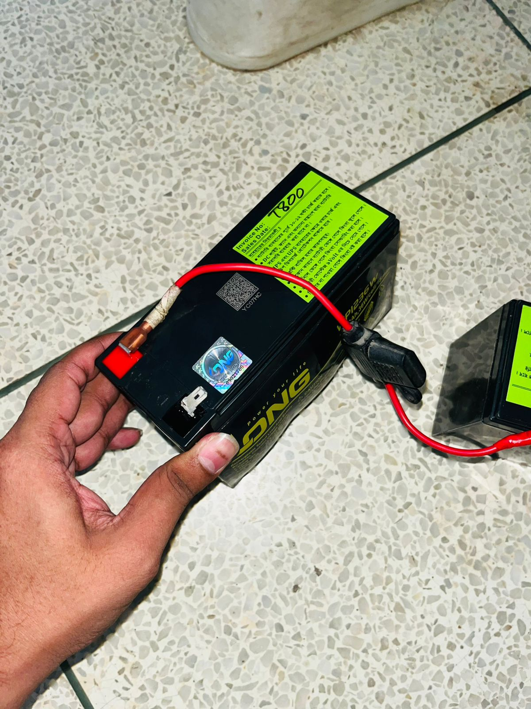 | 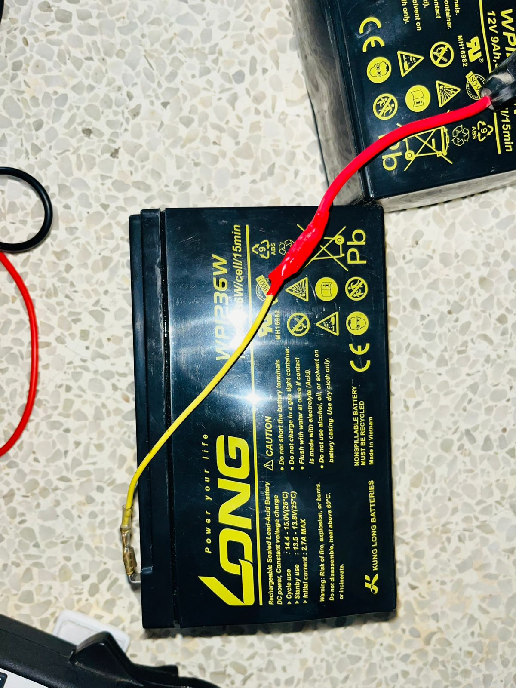 |
| *Burned battery from wrong charger* | *New battery properly installed* |

</div>

#### **Charger Replacement (Root Cause Fix)**

<div align="center">

| Wrong Charger V1 | Wrong Charger V2 |
|:----------------:|:----------------:|
| 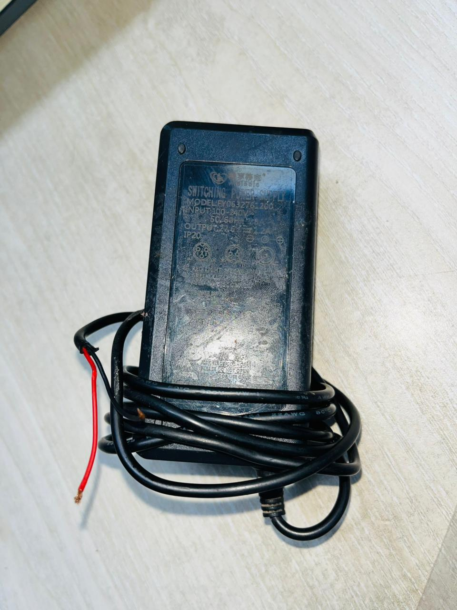 | 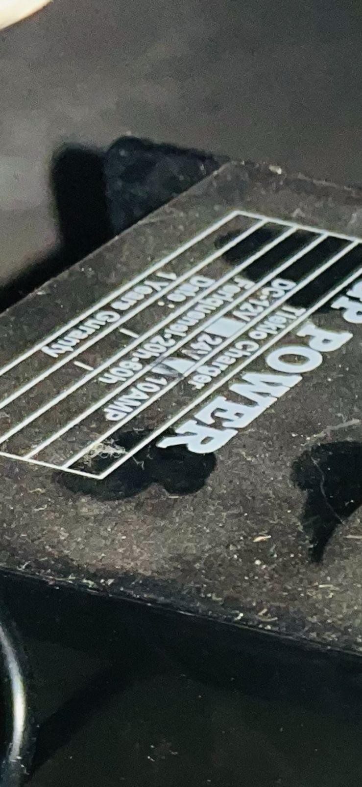 |
| *Incompatible charger (caused damage)* | *Another incompatible unit* |

</div>

<div align="center">

| Correct Charger Installed | Charger Details |
|:-------------------------:|:---------------:|
| 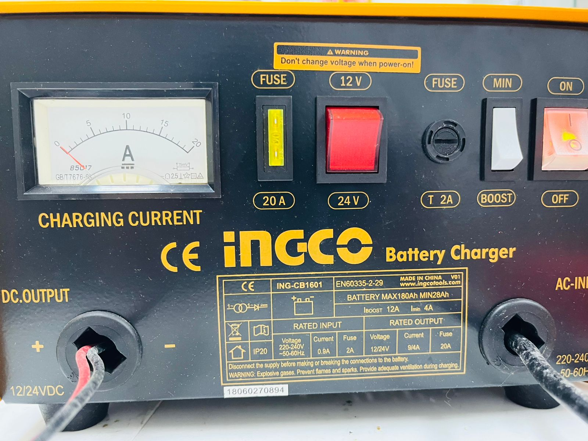 | 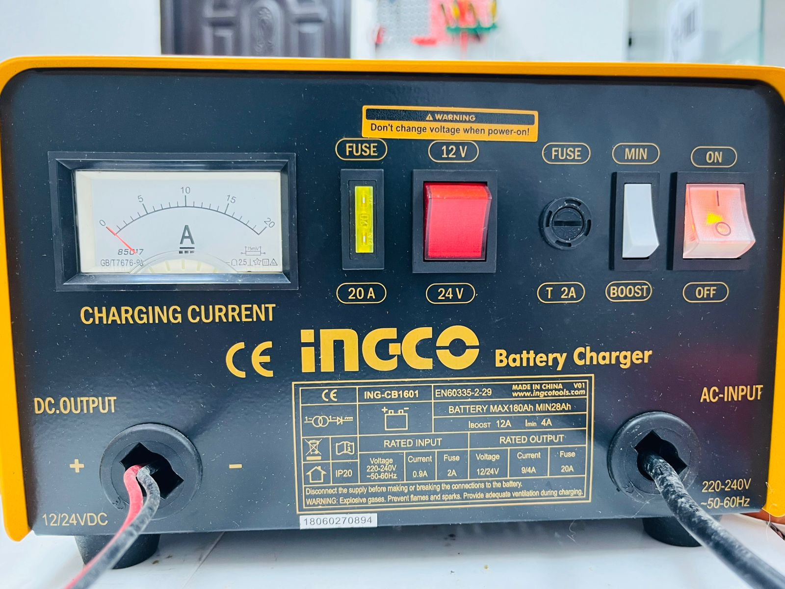 |
| *Proper 24V charger - Problem solved* | *Charger specifications verified* |

</div>

#### **Fuse Protection System**

<div align="center">

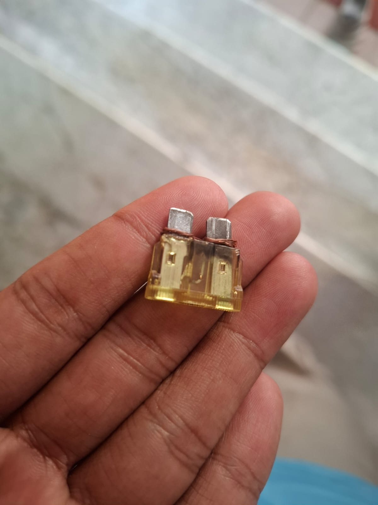

*Bad fuse connection with loose wiring setup*

</div>

---

### **Energy Monitoring System Implementation:**

<div align="center">

| Energy Monitoring Device | Monitoring Interface |
|:------------------------:|:--------------------:|
| 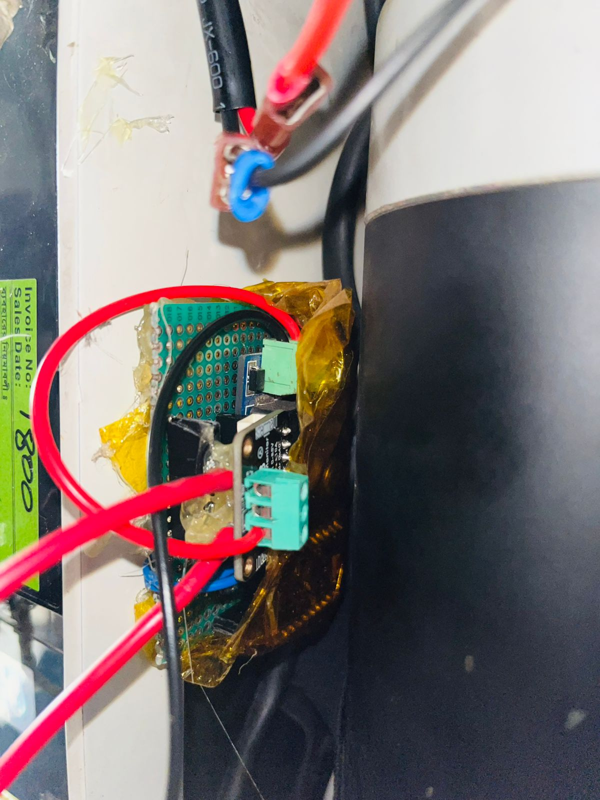 | 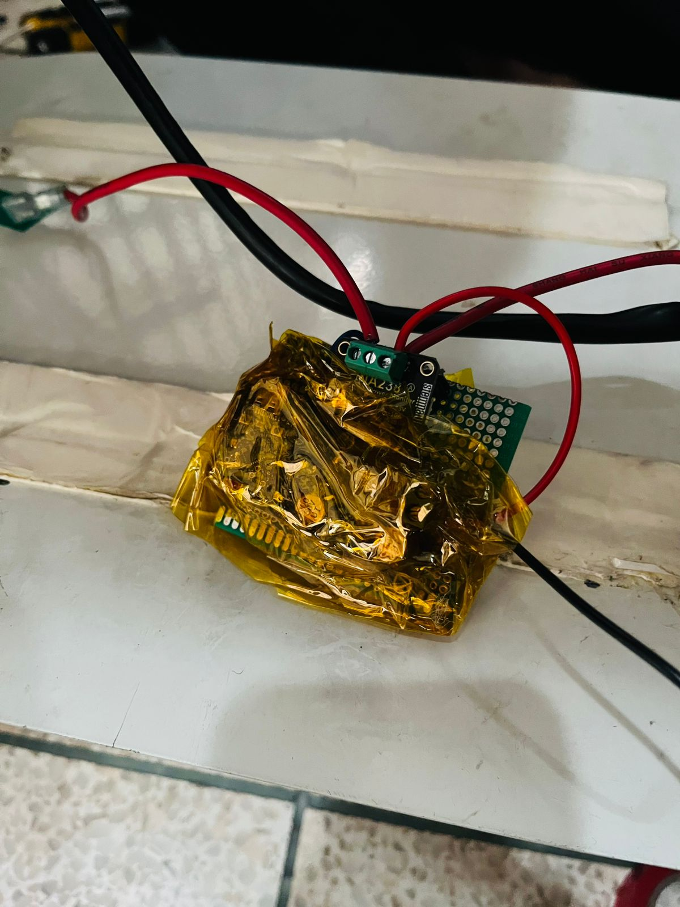 |
| *INA238 sensor with ESP32-C6* | *Hardware setup details* |

</div>

<div align="center">

| Live Dashboard View 1 | Live Dashboard View 2 |
|:---------------------:|:---------------------:|
| 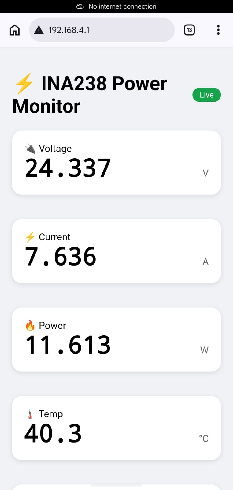 | 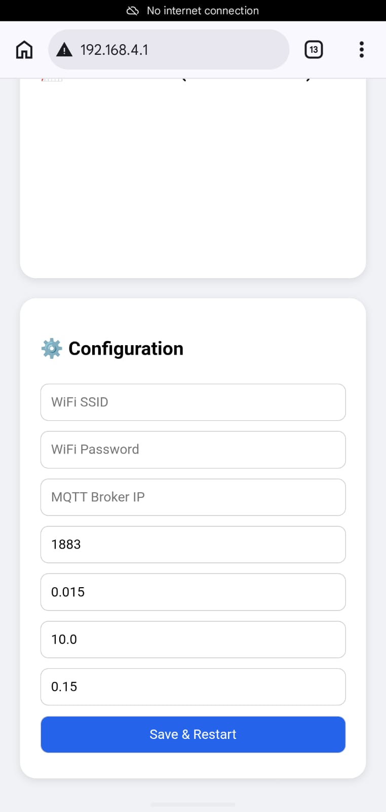 |
| *Real-time power monitoring dashboard* | *Energy consumption tracking* |

</div>

---

## 🎯 Key Achievements

✅ **Successfully diagnosed and resolved critical hardware failures**  
✅ **Implemented robust safety features with redundant protection**  
✅ **Developed intelligent control system with state machine logic**  
✅ **Added real-time energy monitoring with web interface**  
✅ **Created comprehensive data logging and analysis tools**  
✅ **Ensured user safety with multiple fail-safe mechanisms**  
✅ **Documented entire rehabilitation process for future reference**

---


## 🤝 Contributors

This project was made possible by the collaborative efforts of:

1. **SAMA E SHAN SHOUMMO** - Hardware Diagnosis & Repair
2. **SULTAN MAHMUD SAAD** - Control System Development
3. **NAFIS MOHAMMAD REDWAN** - Energy Monitoring System
4. **JULFIKER IBN HAIDER** - System Integration & Testing

---


*Last Updated: May 2026*
